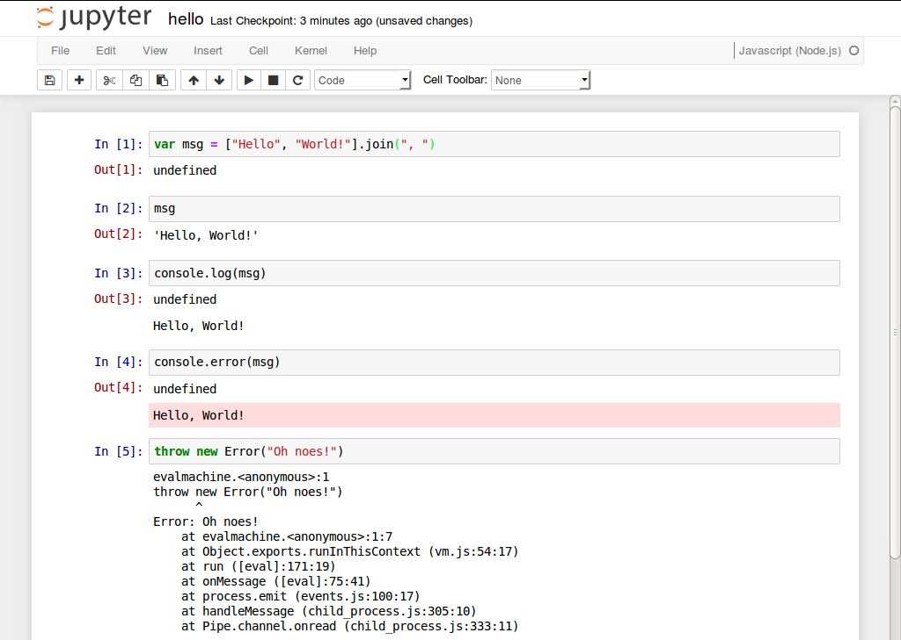

<nav style="float: left;
            padding: 2em;
            margin: 0 2em 2em 0;
            border: 1px solid;
            border-radius: 10px;
            text-align: center;">
<h1></h1>
<a href="http://n-riesco.github.io/ijavascript">IJavascript Home Page</a><br>
<a href="http://github.com/n-riesco/ijavascript">IJavascript Repository</a><br>
<a href="http://github.com/n-riesco/jp-babel">jp-babel Repository</a><br>
<a href="http://github.com/n-riesco/jp-coffeescript">jp-coffeescript Repository</a><br>
</nav>


# IJavascript

IJavascript is a Javascript kernel for the [Jupyter
notebook](http://jupyter.org/). The Jupyter notebook combines the creation of
rich-text documents (including equations, graphs and videos) with the execution
of code in a number of programming languages. The execution of code is carried
out by means of a kernel that implements the [Jupyter messaging
protocol](http://jupyter-client.readthedocs.io/en/latest/messaging.html).

The IJavascript kernel executes Javascript code inside a
[Node.js](https://nodejs.org/) session. And thus, it behaves as the Node.js REPL
does, providing access to the Node.js standard library and to any installed
[npm](https://www.npmjs.com/) modules.

There are kernels available for [Python](http://ipython.org/notebook.html),
[Julia](https://github.com/JuliaLang/IJulia.jl),
[Ruby](https://github.com/minad/iruby),
[Haskell](https://github.com/gibiansky/IHaskell) and [many
other languages](https://github.com/jupyter/jupyter/wiki/Jupyter-kernels).

<div style="clear: both;" />

Here's a sample notebook that makes use of the IJavascript kernel:




## Contents

- [Announcements](#announcements)
- [Main Features](#main-features)
- [Installation](#installation)
- [Troubleshooting](https://github.com/n-riesco/ijavascript/issues/260)
- [Usage](#usage)
- [Contributions](#contributions)
- [TODO](#todo)


## Announcements

- IJavascript v5.2 builds have started to fail in Node.js v0.10, because the
  installation of `zeromq` depends on `prebuild-install` and they are now
  using `const` declarations.
- SUPPORT NOTICE: IJavascript v5.2 will be the last version supporting
  Node.js 0.10, Node.js 4, Node.js 6 and Node.js 8.
- IJavascript v5.1 added new functionality to the API (see
  [NEL](https://github.com/n-riesco/nel) for preliminary documentation):
  - `$$.clear({wait})` to send a `clear_output` request.
  - `$$.display({id})` to send `display_data` and `update_display_data`
    messages.
  - `$$.input(options, {callback})` to send a `input_request` and handle
    `input_reply` messages. 
- Starting with IJavascript v5.0.11, it is possible to customise the output of
  an object based on its type. See the documentation on [custom
  output](http://n-riesco.github.io/ijavascript/doc/custom.ipynb.html) for
  details.
- The use of `$$mimer$$` and `$$defaultMimer$$` to customise output is now
  deprecated.
- To avoid clutter in the global context, the use of `$$async$$`, `$$done$$`,
  `$$mime$$`, `$$html$$`, `$$svg$$`, `$$png$$` and `$$jpeg$$` has also been
  deprecated and replaced with the global object `$$`.


## Main Features

- Run Javascript code inside a `Node.js` session
- [Hello, World!](http://n-riesco.github.io/ijavascript/doc/hello.ipynb.html)
- [Asynchronous
  output](http://n-riesco.github.io/ijavascript/doc/async.ipynb.html)
- [Custom output](http://n-riesco.github.io/ijavascript/doc/custom.ipynb.html)
  for `HTML`, `SVG`, `PNG`, ...
- [Autocompletion](http://n-riesco.github.io/ijavascript/doc/complete.md.html):
  press `TAB` to complete keywords and object properties
- [Object
  inspection](http://n-riesco.github.io/ijavascript/doc/inspect.md.html): press
  `Shift-TAB` to inspect an object and show its content or, if available, its
  documentation


## Installation

IJavascript is distributed as an [npm](https://www.npmjs.com/) package and thus
it requires:

- [Node.js](http://nodejs.org/)
- [npm](https://www.npmjs.com/)

Depending on your use, other [Jupyter tools](http://jupyter.org/) will be
necessary (e.g. Jupyter notebook). Note that IJavascript has been kept
backwards-compatibility with IPython v1, so that it's possible to use the
IPython notebook distributed in Ubuntu 14.04 LTS and Ubuntu 16.04 LTS.

For other platforms  not listed below, or if you find any problems with the instructions above,
please, refer to the [installation
notes](http://n-riesco.github.io/ijavascript/doc/install.md.html).

### Ubuntu

To install IJavascript in Ubuntu 18.04 for your user only, run:

```
sudo apt-get install nodejs npm jupyter
npm config set prefix $HOME
npm install -g ijavascript
ijsinstall
```

Note: if `~/bin` folder didn't exist before, after running this instructions, you may need to log out and back in for `~/bin` to be added to your `PATH`.

To install IJavascript in Ubuntu 18.04 for all users, run instead:

```
sudo apt-get install nodejs npm jupyter
sudo npm install -g --unsafe-perm ijavascript
sudo ijsinstall --install=global
```

Also, note that older versions of Ubuntu (e.g. Ubuntu 16.04 LTS) depend on `nodejs-legacy` and `ipython-notebook` instead:

```sh
sudo apt-get install nodejs-legacy npm ipython ipython-notebook
```

### Windows (Official Python Distribution)

In the command line:

```sh
pip3 install --upgrade pip
pip3 install jupyter
npm install -g ijavascript
ijsinstall
# Or run: %appdata%\npm\ijsinstall
```

Then you can run `jupyter notebook` in your terminal to load Jupyter Notebook. 
When you create a new Jupyter Notebook, you should see the Javascript (Node) 
kernel available.


### Windows (Anaconda Distribution)

Open the *Anaconda prompt* and run:

```sh
conda install nodejs
npm install -g ijavascript
ijsinstall
```

Then you can run `jupyter notebook` in your terminal to load Jupyter Notebook. 
When you create a new Jupyter Notebook, you should see the Javascript (Node) 
kernel available.


### macOS

In macOS, [Homebrew](http://brew.sh/) and
[pip](https://pip.pypa.io/en/latest/installing) can be used to install
IJavascript and its prerequisites:

```sh
/bin/bash -c "$(curl -fsSL https://raw.githubusercontent.com/Homebrew/install/HEAD/install.sh)"
brew install pkg-config node zeromq
sudo easy_install pip
pip install --upgrade pyzmq jupyter
npm install -g ijavascript
ijsinstall
```

## Usage

IJavascript provides 5 executables: `ijsinstall`, `ijsnotebook`, `ijsconsole`,
`ijskernel` and `ijs`. Their purpose and basic use is described in the sections
below. Please, refer to the [usage
notes](http://n-riesco.github.io/ijavascript/doc/usage.md.html) for further
details.


### `ijsinstall`: IJavascript kernel spec installer

`ijsinstall` registers the IJavascript kernel with Jupyter, so that other tools
(e.g. the Jupyter notebook) can invoke it. The following command flags are
recognised:

```
--debug                   enable debug messages
--help                    show this help
--hide-undefined          do not show undefined results
--install=[local|global]  install kernel for current user or globally
--protocol=version        set messaging protocol version, e.g. 5.0
--show-undefined          show undefined results
--spec-path=[none|full]   set whether kernel spec uses full paths
--startup-script=path     run script on kernel startup
                          (path can be a file or a folder)
--version                 show kernel version
--versions                show kernel and library versions
--working-dir=path        set kernel working directory
                          (default = current working directory)
```


### `ijsnotebook`: IJavascript notebook

After running `ijsinstall`, Jupyter notebook users can invoke the Jupyter
notebook as usual. `ijsnotebook` is provided for convenience to users of the
IPython notebook prior to version 3. `ijsnotebook` is a wrapper around
`ipython notebook`. It extends the command flags accepted by `ipython notebook`
with the following:

```
--help                        show IJavascript and notebook help
--ijs-debug                   enable debug messages
--ijs-help                    show this help
--ijs-hide-undefined          do not show undefined results
--ijs-install=[local|global]  install kernel for current user or globally
--ijs-protocol=version        set protocol version, e.g. 5.0
--ijs-show-undefined          show undefined results
--ijs-spec-path=[none|full]   set whether kernel spec uses full paths
--ijs-startup-script=path     run script on startup
                              (path can be a file or a folder)
--ijs-working-dir=path        set kernel working directory
                              (default = current working directory)
--version                     show kernel version
--versions                    show kernel and library versions
```


### `ijsconsole`: IJavascript console

`ijsconsole` is provided for convenience to users as a wrapper around `ipython
console`. The following command flags are recognised:

```
--help                        show IJavascript and notebook help
--ijs-debug                   enable debug messages
--ijs-help                    show this help
--ijs-hide-undefined          do not show undefined results
--ijs-install=[local|global]  install kernel for current user or globally
--ijs-protocol=version        set protocol version, e.g. 5.0
--ijs-show-undefined          show undefined results
--ijs-spec-path=[none|full]   set whether kernel spec uses full paths
--ijs-startup-script=path     run script on startup
                              (path can be a file or a folder)
--ijs-working-dir=path        set kernel working directory
                              (default = current working directory)
--version                     show kernel version
--versions                    show kernel and library versions
```


### `ijskernel`: IJavascript kernel

`ijskernel` is the executable invoked by Jupyter tools (e.g. the notebook) and
that appears in the kernel spec that `ijsinstall` creates for IJavascript. You
won't need this command, unless you want to create a custom kernel spec.

```
Usage:
    ijskernel [options] connection_file

Options:
    --debug                           enable debug messages
    --hide-undefined                  do not show undefined results
    --protocol=Major[.minor[.patch]]  set protocol version, e.g. 5.0
    --session-working-dir=path        set session working directory
    --show-undefined                  show undefined results
    --startup-script=path             run script on startup
					  (path can be a file or a folder)
```


### `ijs`: Deprecated CLI

`ijs` is provided for backwards-compatibility. It will be removed in the next
major-version update. Please, use `ijsinstall` or `ijsnotebook` instead.


# Contributions

First of all, thank you for taking the time to contribute. Please, read
[CONTRIBUTING](http://n-riesco.github.io/ijavascript/contributing.html) and use
the [issue tracker](https://github.com/n-riesco/ijavascript/issues) for any
contributions: support requests, bug reports, enhancement requests, pull
requests, submission of tutorials...


# TODO

See the [issue tracker](https://github.com/n-riesco/ijavascript/issues) and the
TODO list in the packages [jp-kernel](https://github.com/n-riesco/jp-kernel) and
[NEL](https://github.com/n-riesco/nel) for additional items.
