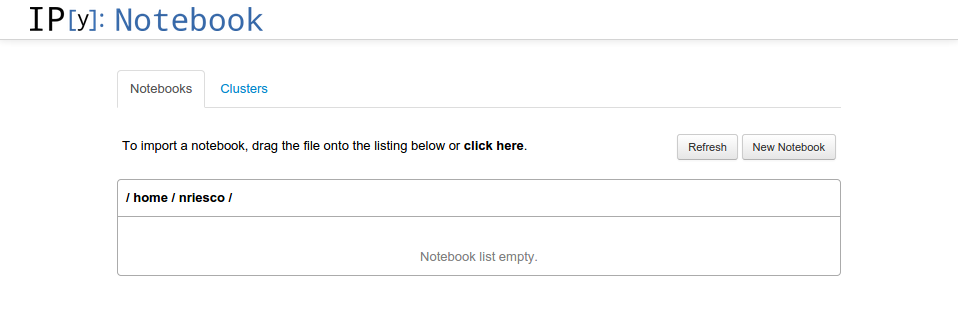
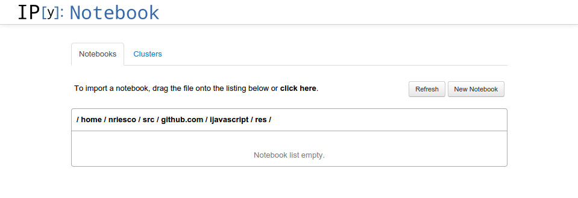
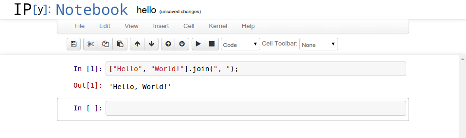

# IJavascript: A Javascript Kernel for IPython's Graphical Notebook

IJavascript is an [`npm` package](https://www.npmjs.com/) that implements a
Javasript kernel for [IPython's graphical
notebook](http://ipython.org/notebook.html) (also known as
[Jupyter](http://jupyter.org/)). An IPython notebook combines the creation of
rich-text documents (including mathematics, plots and videos) with the execution
of code in a number of programming languages.

The execution of code is carried out by means of a kernel that implements the
[IPython messaging
protocol](http://ipython.org/ipython-doc/stable/development/messaging.html).
There are kernels available for [Python](http://ipython.org/notebook.html),
[Julia](https://github.com/JuliaLang/IJulia.jl),
[Ruby](https://github.com/minad/iruby),
[Haskell](https://github.com/gibiansky/IHaskell) and now Javascript.

IJavascript implements the latest stable specification of the protocol, [version
4.1](http://ipython.org/ipython-doc/stable/development/messaging.html).  This
specification will be updated to [version
5.0](http://ipython.org/ipython-doc/dev/development/messaging.html) in the
next release of IPython.

A repository of IPython notebooks can be found
[here](http://nbviewer.ipython.org/).

## Prerequisites

The installation instructions of the prerequisites vary from platform to
platform. In the Debian and Ubuntu distributions, it's enough to run the
following command:

```sh
sudo apt-get install npm ipython ipython-notebook
```

For other platforms, instructions may be found at
[nodejs.org/download](http://nodejs.org/download/) and
[ipython.org/install](http://ipython.org/install.html).

## Installation

```sh
npm install ijavascript
```

## Usage

To start an IPython notebook session with the Javascript kernel, simply run:

```sh
ijs
```

This command should open the IPython notebook dashboard in your default web
browser:



By default, the dashboard opens the notebooks in the current working folder. The
command flag `--notebook-dir=path/to/another/folder` can be used to open the
dashboard at a different folder:

```sh
ijs --notebook-dir=path/to/another/folder
```



Here's a sample notebook that makes use of the Javascript kernel:



By default, the Javascript kernel doesn't define `global`. If security is not a
concern `global` can be enabled by passing the following command flag:

```sh
ijs --ijs-enable-global
```


To obtain documentation for other command flags, run:

```sh
ipython notebook help
```

## TO DO

- Capture `stdout` and `stdin` of each Javascript session (this may require
  replacing vm with vm2).

- Complete the implementation of IPython's messaging protocol.
