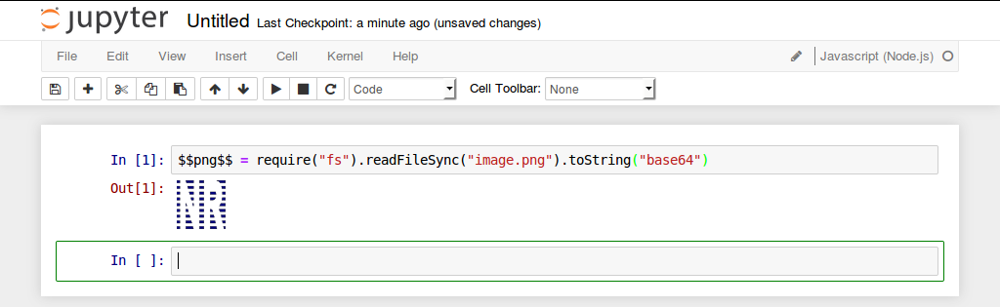

# Graphical output

IJavascript provides a number of global variables to produce a graphical output.

## Text formats

IJavascript can output `HTML` and `SVG`.

### `$$html$$`

To output `HTML` simply assign a string with the HTML to the global variable
`$$html$$`. See the example below:

```javascript
$$html$$ = "<div style='background-color:olive;width:50px;height:50px'></div>"
```


### `$$svg$$`

Similarly, it is possible to output `SVG` by assigning a string to the global
variable `$$svg$$`:

```javascript
$$svg$$ = "<svg><rect width=80 height=80 style='fill: orange;'/></svg>"
```


## Binary formats

IJavascript can also output pictures in `PNG` and `JPEG` formats. However, this
formats are binary and need to be encoded in `base64`. See how in the following
examples.

### `$$png$$`

In the below example, a `PNG` file is read, then encoded in `base64` and finally
assigned to the global variable `$$png$$`:

```javascript
$$png$$ = fs.readFileSync("image.png").toString("base64");
```



### `$$jpeg$$`

Similarly with `JPEG` files and the global variable `$$jpeg$$`:

```javascript
$$jpeg$$ = fs.readFileSync("image.jpg").toString("base64");
```


## MIME output

IJavascript also provides the global variable `$$mime$$` to produce an output in
any other format understood by the IPython frontend. Following is an example
where instead of assigning an HTML string to the global variable `$$html$$`, the
global variable `$$mime$$` is assigned an object with the HTML string assigned
to the property `"text/html"`:

```javascript
$$mime$$ = {"text/html": "<div style='background-color:olive;width:50px;height:50px'></div>"};
```


